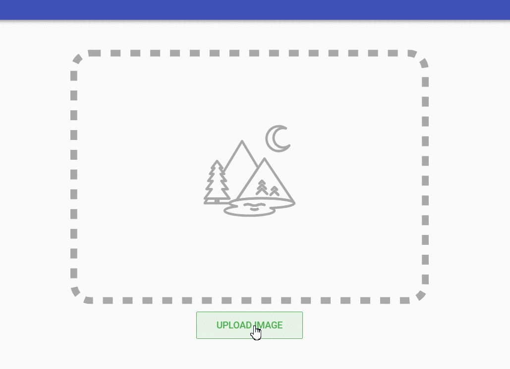

# gender-detection

Detect gender using tensorflowjs.



> Uses [Gender classification model](https://github.com/arunponnusamy/gender-detection-keras) by [arunponnusamy](https://github.com/arunponnusamy)

## Processing Steps

1.  Detects Face using [Tracking.js](https://trackingjs.com) for more accuracy.
2.  Loads gender model using [Tensorflow.js](https://js.tensorflow.org)
3.  Based on the confidence value we choose Man / woman


> Gender detection model used here is not a well trained model. So accuracy will be a bit low.

## Project setup

### Installs dependencies
```
yarn install
```


### Compiles and hot-reloads for development
```

yarn run serve

```
### Compiles and minifies for production
```

yarn run build

```

